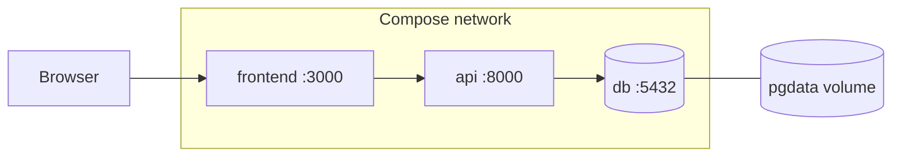

# Local stack

The browser reaches PostgreSQL through the frontend and API, and PostgreSQL stores its data in the `pgdata` volume.

```mermaid
flowchart LR
    Browser["Browser"]

    subgraph Compose["Compose network"]
        Frontend["frontend :3000"] --> API["api :8000"]
        API --> DB[("db :5432")]
    end

    Browser --> Frontend
    DB --- Volume[("pgdata volume")]
```